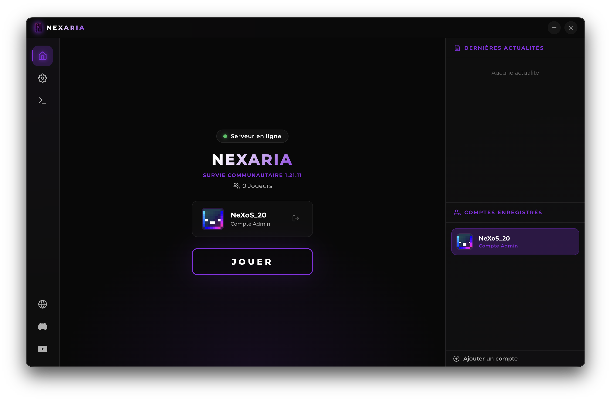

# Nexaria Launcher

Nexaria Launcher est un launcher Minecraft premium, moderne et sécurisé, conçu avec **Electron.js**. Il offre une interface élégante (inspirée de Nexaria) et des fonctionnalités avancées pour une expérience de jeu fluide.



## ✨ Fonctionnalités

- **Interface Moderne** : Design sombre avec accents violets Nexaria, coins arrondis (12px), et animations fluides (pulse, glow).
- **Multi-Comptes** : Gestion simplifiée de plusieurs comptes avec authentification sécurisée via Azuriom.
- **Sécurité Mail** : Restriction de connexion aux utilisateurs ayant validé leur adresse email pour plus de sécurité.
- **Mods Optionnels** : Menu dédié pour installer/désinstaller des mods (Iris, Xaero, ReplayMod) configurables via un fichier JSON distant.
- **Personnalisation (Skin API)** : Changez votre skin et votre cape directement depuis le launcher grâce à l'intégration Azuriom Skin API.
- **Exportateur de Crashs** : Détection automatique des plantages avec affichage du rapport et bouton de copie rapide pour le support.
- **Mises à jour Silencieuses** : Le launcher se met à jour, s'installe et redémarre automatiquement.
- **Java Auto-Installer** : Détecte et installe le JRE 21 nécessaire de manière transparente.
- **Discord Rich Presence** : Affiche votre activité de jeu sur Discord avec statut en temps réel.
- **Statut Serveur** : Visualisation en direct de l'état du serveur et des joueurs en ligne.

## 🚀 Installation

### Pour les Joueurs
Vous pouvez télécharger la dernière version pour votre système directement dans les **[Releases GitHub](https://github.com/nexos20lv/Nexaria-Launcher/releases)**.

Pour des instructions détaillées par plateforme (Windows, Mac, Linux), consultez notre **[Guide d'Installation](INSTALL.md)**.

### Pour les Développeurs (Build Local)
1. Clonez le dépôt :
   ```bash
   git clone https://github.com/nexos20lv/Nexaria-Launcher.git
   cd nexaria-launcher
   ```
2. Installez les dépendances :
   ```bash
   npm install
   ```
3. Lancez en mode dev :
   ```bash
   npm start
   ```

## ⚙️ Configuration

### Launcher
La configuration principale se fait dans les fichiers `src/launcher/` :
- `auth.js` : Modifiez `AZURIOM_URL` pour pointer vers votre site.
- `downloader.js` : Modifiez `DEFAULT_FILE_SERVER_URL` pour votre serveur de fichiers.
- `server.js` : Modifiez `MC_HOST` et `MC_PORT` pour votre serveur Minecraft.

### Serveur de fichiers (PHP)
Le dossier `php-server/` doit être déployé sur un hébergement web. 
1. Uploadez le contenu de `php-server/`.
2. Configurez `config.php` avec vos versions de Minecraft et de loader.
3. Placez vos fichiers (mods, config) dans le dossier `files/`.
4. Configurez vos **mods optionnels** dans `optional_mods.json` (Iris, Minimap, etc.) avec leurs liens de téléchargement.
   - Option recommandé : ajoutez `sha1` par mod pour activer la vérification d'intégrité côté launcher.
Le manifest se génère automatiquement !

## 🏗️ Structure du Projet

```text
Nexaria Launcher/
├── package.json        # Configuration Node.js et Electron
├── php-server/         # Backend du serveur de fichiers (PHP)
└── src/
    ├── main.js         # Processus principal Electron
    ├── preload.js      # Pont entre Electron et le Front-end
    ├── launcher/       # Logique métier (Auth, Game, Download)
    └── renderer/       # Interface utilisateur (HTML, CSS, JS)
```

## 🛠️ Build (Production)

Pour créer un exécutable (.exe, .dmg, .AppImage) :
```bash
npm run build
```

## 📄 Licence
Ce projet est distribué sous licence MIT. Voir `LICENSE` pour plus de détails.
